# Complete System Architecture

## System Overview

This is a full-stack serverless workflow development platform that combines AI-powered workflow generation, real-time validation, visual DAG rendering, and robust Temporal-based execution orchestration.

## System Architecture Diagram

```mermaid
graph TB
    %% User Layer
    subgraph "👤 User Interface"
        User[User<br/>Natural Language Input]
    end

    %% Frontend Layer
    subgraph "🌐 Frontend Application"
        UI[Web Interface<br/>Next.js 15<br/>• Workflow DAG Visualizer<br/>• AI Chatbot Interface<br/>• ReactFlow Renderer]
    end

    %% Backend Layer
    subgraph "⚙️ Backend Services"
        subgraph "🔌 API Gateway"
            API[HTTP API Server<br/>Port :8088<br/>• REST Endpoints<br/>• Request Routing<br/>• Error Handling]
        end
        
        subgraph "📋 DSL Workflow Spec"
            Engine[CNCF Serverless Workflow SDK<br/>• Switch/For/Fork Tasks<br/>• Expression Evaluation<br/>• JSON/YAML Support<br/>• State Management]
        end
    end

    %% Orchestration Layer
    subgraph "🏗️ Workflow Execution Platform"
        Temporal[Temporal Server<br/>• Workflow Orchestration<br/>• State Persistence<br/>• Durable Execution<br/>• Activity Management]
        
        subgraph "🔄 Temporal Workflows"
            ChatWorkflow[ChatbotWorkflow<br/>• AI Conversation State<br/>• Uses CNCF SDK for Parsing<br/>• Validation & Auto-Correction]
            ExecWorkflow[ExecuteServerlessWorkflow<br/>• Dynamic Activity Execution<br/>• Uses Generated Definitions<br/>• State Management]
        end
        
        subgraph "🔄 Auto-Correction Loop"
            Loop[LLM Validation Process<br/>1. Generate Workflow<br/>2. Parse & Validate<br/>3. Detect Errors<br/>4. Request Correction<br/>5. Re-validate Until Valid]
        end
    end

    %% AI Services
    subgraph "🤖 AI Services"
        Claude[Anthropic Claude 4 Sonnet<br/>• Workflow Generation<br/>• Code Validation<br/>• Auto-Correction<br/>• Natural Language Processing]
    end

    %% Demo Services
    subgraph "🧪 Demo Services"
        Demo[HTTP Demo Endpoints<br/>• Testing Services<br/>• Mock APIs<br/>• Random Delays]
    end

    %% User Flow
    User -.->|"Describe Workflow"| UI
    UI -.->|"Display Results"| User

    %% Main Data Flow
    UI <-->|"HTTP/WebSocket"| API
    API <-->|"Temporal Client"| Temporal
    API <-->|"Direct Integration"| Engine
    
    %% AI Integration
    Temporal <-->|"Activity Calls"| Claude
    Claude <-->|"Validation Loop"| Loop
    Loop <-->|"Schema Validation"| Engine
    
    %% Testing & Demo
    Engine -->|"HTTP Tasks"| Demo
    Temporal -->|"Activity Execution"| Demo

    %% Styling
    classDef user fill:#f8f9fa,stroke:#495057,stroke-width:3px,color:#000
    classDef frontend fill:#e3f2fd,stroke:#1976d2,stroke-width:2px
    classDef backend fill:#f3e5f5,stroke:#7b1fa2,stroke-width:2px
    classDef orchestration fill:#fff3e0,stroke:#f57c00,stroke-width:2px
    classDef ai fill:#e8f5e8,stroke:#388e3c,stroke-width:2px
    classDef demo fill:#fce4ec,stroke:#c2185b,stroke-width:2px
    classDef loop fill:#fff8e1,stroke:#fbc02d,stroke-width:2px

    class User user
    class UI frontend
    class API,Engine backend
    class Temporal,Loop orchestration
    class Claude ai
    class Demo demo
```

## Detailed Component Architecture

### 1. Frontend Components (Next.js 15)

#### User Interface Layer
- **Split Screen Interface**: Workflow visualizer on left, chatbot on right
- **Weaver AI Assistant**: Conversational interface for workflow generation
- **ReactFlow DAG Renderer**: Interactive workflow visualization with:
  - Hierarchical node positioning
  - Fork/join pattern recognition
  - Color-coded task types
  - Theme-aware styling

#### Frontend Logic Layer
- **Workflow Parser**: Extracts and validates workflow code from chat messages
- **State Management**: React hooks for UI, workflow, and conversation state
- **API Routes**: Next.js API proxy layer for backend communication

### 2. Backend Components (Go)

#### HTTP API Layer
- **REST Handlers**: Workflow execution, chatbot interface, state queries
- **Request Routing**: Multiple endpoints for different workflow formats
- **Error Handling**: Comprehensive error responses and logging

#### Temporal Orchestration Engine
- **ChatbotWorkflow**: Persistent conversation state with AI integration
- **Workflow Execution**: YAML/JSON serverless workflow orchestration
- **Activities**: HTTP calls, expression evaluation, parallel execution
- **State Management**: Query handlers, signal processing, persistence

#### Workflow Engine
- **CNCF SW Engine**: Implements Serverless Workflow 1.0.0 specification
- **Task Types**: HTTP, set, do, fork, switch, for tasks
- **Expression Engine**: Property access and comparison evaluation
- **SDK Integration**: Parsing and validation using official SDK

### 3. LLM Validation & Auto-Correction Loop

The system implements a sophisticated validation loop:

### 4. Data Flow Architecture

#### Workflow Creation Flow
1. **User Input**: Natural language workflow description
2. **LLM Generation**: Claude generates CNCF-compliant workflow
3. **Auto-Detection**: Frontend parses workflow from chat response
4. **Validation**: Backend validates using serverless workflow SDK
5. **Visualization**: ReactFlow renders interactive DAG
6. **Execution**: Direct execution from chat interface

#### Validation & Correction Flow
1. **Error Detection**: SDK validation identifies spec violations
2. **Error Feedback**: Detailed error messages sent to Claude
3. **Auto-Correction**: Claude generates corrected workflow
4. **Re-validation**: Iterative validation until success (max 4 retries)
5. **User Notification**: Success/failure feedback in chat

#### State Management Flow
1. **Conversation State**: Maintained in Temporal ChatbotWorkflow
2. **Workflow State**: Tracked during execution with query handlers
3. **UI State**: React state for interface and visualization
4. **Persistence**: Temporal ensures state durability

## Key Features & Capabilities

### AI-Powered Workflow Generation
- **Natural Language**: Describe workflows in plain English
- **Intelligent Generation**: Claude understands CNCF specification
- **Auto-Correction**: Self-healing workflow generation
- **Multi-Format**: Supports both JSON and YAML workflows

### Advanced Workflow Execution
- **Switch Tasks**: Conditional branching with expression evaluation
- **For Tasks**: Collection iteration with loop variables
- **Fork Tasks**: Parallel execution with proper synchronization
- **HTTP Tasks**: REST API calls with full request/response handling
- **Expression Engine**: Property access and comparison operations

### Visualization & UX
- **Interactive DAGs**: Clickable, draggable workflow visualization
- **Real-time Updates**: Live workflow state during execution
- **Error Visualization**: Visual feedback for validation errors
- **Theme Support**: Dark/light mode compatibility

### Robust Orchestration
- **Temporal Integration**: Durable, reliable workflow execution
- **State Persistence**: Conversation and workflow state maintained
- **Error Handling**: Comprehensive retry and timeout mechanisms
- **Monitoring**: Query-based state inspection and debugging

## Integration Benefits

1. **Developer Experience**: Natural language → executable workflows
2. **Visual Debugging**: See workflow structure before execution
3. **Iterative Development**: Chat-based refinement and correction
4. **Production Ready**: Temporal-based reliability and scalability
5. **CNCF Compliance**: Full Serverless Workflow 1.0.0 support
6. **Extensible**: Easy to add new task types and capabilities

This architecture creates a complete workflow development platform that bridges the gap between natural language descriptions and production-ready serverless workflow execution.

## CNCF to Temporal Execution Engine Mapping

The following diagram illustrates how CNCF Serverless Workflow specifications are transformed into executable Temporal workflows:

```mermaid
graph TD
    %% Input Layer
    subgraph "📋 CNCF Workflow Definition"
        YAML[YAML/JSON Workflow Spec<br/>• Declarative task definitions<br/>• Hierarchical structure<br/>• Control flow primitives]
    end
    
    %% Temporal Workflow Engine - Expanded
    subgraph TemporalEngine ["⚙️ Temporal Workflow Engine"]
        direction TB
        
        Parser[🔍 CNCF SDK Parser Activity<br/>• Validation<br/>• AST Generation<br/>• Type Detection]
        
        Tree[🌳 Task Execution Tree<br/>• Sequential tasks<br/>• Parallel branches - fork<br/>• Conditional logic - switch<br/>• Iteration loops - for<br/>• Nested compositions - do]
        
        Mapping[⚙️ Task Item Execution<br/>executeTaskItem recursion]
        
        subgraph PrimitivesLayer ["🔧 Temporal Primitives"]
            Activity[workflow.ExecuteActivity<br/>Non-deterministic operations]
            Parallel[workflow.Go<br/>Parallel execution]
            State[Workflow State<br/>Deterministic logic]
            Query[Query Handlers<br/>State inspection]
        end
    end
    
    %% External Systems Layer
    subgraph "🌐 External Systems"
        HTTP[HTTP APIs<br/>Third-party services]
        AI[AI Services<br/>Anthropic Claude]
        Demo[Demo Services<br/>Testing endpoints]
    end
    
    %% Flow connections within Temporal
    YAML -->|"Workflow Input"| Parser
    Parser -->|"Validated AST"| Tree
    Tree -->|"Execution Plan"| Mapping
    
    %% Task type mappings
    Mapping -->|"HTTP Tasks"| Activity
    Mapping -->|"Fork Tasks"| Parallel
    Mapping -->|"Set/Switch/For Tasks"| State
    Mapping -->|"State Queries"| Query
    
    %% External execution
    Activity -->|"HTTPCallActivity"| HTTP
    Activity -->|"AI Activities"| AI
    Activity -->|"Demo Activities"| Demo
    
    %% Styling
    classDef cncf fill:#e8f5e8,stroke:#388e3c,stroke-width:2px
    classDef temporal fill:#e3f2fd,stroke:#1976d2,stroke-width:2px
    classDef external fill:#fce4ec,stroke:#c2185b,stroke-width:2px
    
    class YAML cncf
    class Parser,Tree,Mapping,Activity,Parallel,State,Query temporal
    class HTTP,AI,Demo external
```

### Key Benefits of This Mapping:

1. **Clean Separation**: Each layer has distinct responsibilities
2. **Type Safety**: CNCF task types map directly to Temporal patterns
3. **Deterministic Replay**: Temporal can replay the execution tree reliably
4. **State Management**: Workflow state is preserved across task boundaries
5. **Parallel Execution**: Fork tasks leverage Temporal's concurrency primitives
6. **Error Handling**: Activity failures are handled by Temporal's retry mechanisms
7. **Observability**: Query handlers provide real-time workflow inspection

Each CNCF task type maps to specific Temporal patterns
- HTTP Tasks → Activities (non-deterministic operations)
- Set Tasks → Workflow state updates (deterministic)
- Fork Tasks → Parallel activity execution
- Switch Tasks → Conditional workflow logic
- For Tasks → Loops with state iteration