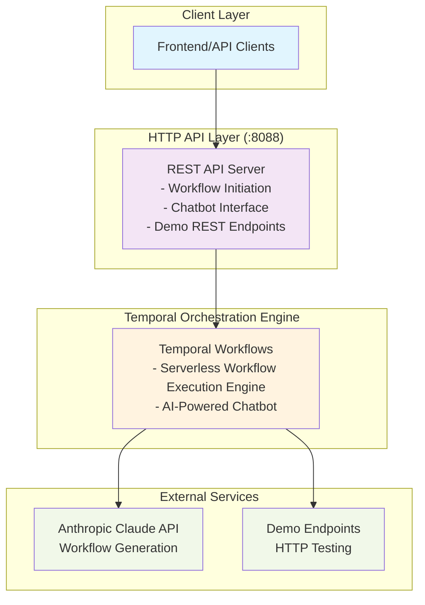

# Serverless Workflow Backend - A Learning

- Serverless Workflow Specification
  - a vendor-neutral, open-source, and entirely community-driven ecosystem tailored for defining and executing DSL-based workflows in the realm of Serverless technology.
  - V1.0.0 was released in Jan 2025, but tooling has lagged behind, e.g. vscode extension for [Serverless Workflow](https://marketplace.visualstudio.com/items?itemName=serverlessworkflow.serverless-workflow-vscode-extension) was last updated in 2021 and supports v0.6 only
  - SDKs are more up-to-date, and was very useful having a parser/validator in the [go SDK](https://github.com/serverlessworkflow/sdk-go) to validate and provide feedback on sample serverless workflow definitions
  - using Claude to generate samples, and building a visualisation engine iteratively
  - initial hurdles in understanding the serverless workflow spec, nuances in differences between versions, which contributes to difficulty for LLMS, even the likes of Claude 4, to generate valid workflows in a single attempt.
    - e.g. for http call tasks, Claude 4 consistently uses `uri` instead of `endpoint` to specify the target path
  - https://gillesbarbier.medium.com/understanding-the-serverless-workflow-1-0-dsl-6e874a1fd511 is a pretty good primer on the serverless workflow DSL
  - yaml is less verbose than json so uses less tokens
  - [typescript sdk](https://store.epicgames.com/en-US/download) has a `buildGraph` function that builds a DAG for a given workflow definition

- Claude Code
  - fantastic to be able to incrementally build up serverless workflow visualizer from simple workflows, slowly resolving issues with building workflow graph structure from tasks, generating edge relationships between tasks, handling task flow transitions, sequential versus fork tasks, task depth and layout engine
  ```yaml
    document:
    dsl: 1.0.0
    namespace: demo
    name: parallel-processing-workflow
    version: 1.0.0
    do:
    - processInParallel:
        fork:
            branches:
            - processTaskA:
                call: http
                with:
                    method: post
                    endpoint: http://localhost:8088/demo/task-a
                    body:
                    data: "Processing task A"
            - processTaskB:
                call: http
                with:
                    method: post
                    endpoint: http://localhost:8088/demo/task-b
                    body:
                    data: "Processing task B"
            - processTaskC:
                call: http
                with:
                    method: post
                    endpoint: http://localhost:8088/demo/task-c
                    body:
                    data: "Processing task C"
    - combineResults:
        call: http
        with:
            method: post
            endpoint: http://localhost:8088/demo/combine-results
            body:
            results: ${{ [.processTaskA, .processTaskB, .processTaskC] }}
   ```

[image with bad parallel layout]
claude adds debugging code which can be pasted back in for refinement


- Role of Temporal
  - Chat thread workflow
    - full chat audit history
    - self-correction loop - running inference with Claude API with response validation and retry loop with feedback from go SDK workflow parser and validator is invaluable for few-shot correction of workflows
  - Serverless Workflow Execution Engine
    - Temporal workflow that interprets given workflow definition and executes tasks as activities
    - fully deterministic, resilient execution of serverless workflows with workflow execution audit trail
    - The CNCF Serverless Workflow specification is designed around structured, hierarchical control flow patterns that work excellently with tree-based execution.
      - current implementation as a nested execution tree
      - missing 
        - State merging after forks (as you noted)
        - Switch condition evaluation (expression parsing)
        - Loop constructs (for tasks)
        - Error handling (try/catch blocks)
    

## System Architecture Overview



## Key Architecture Components

### 1. **HTTP API Layer**
- **Port**: 8088
- **Framework**: Go standard library HTTP server
- **Endpoints**: Health checks, workflow execution, chatbot interaction, demo endpoints

### 2. **Temporal Orchestration**
- **Engine**: Temporal workflow engine for reliable execution
- **Workflows**: Long-running processes with state persistence
- **Activities**: Individual tasks with retry and timeout capabilities

### 3. **Workflow Engine**
- **Parser**: CNCF Serverless Workflow v1.0 specification support
- **Executor**: Sequential and parallel task execution
- **Validation**: Real-time workflow validation with auto-correction

### 4. **Chatbot Integration**
- **AI Model**: Anthropic Claude 4 Sonnet
- **Validation**: Automatic workflow validation and correction
- **State**: Persistent conversation with processing state tracking

### 5. **Demo System**
- **Endpoints**: `/demo/*` for testing HTTP calls
- **Simulation**: Random delays (1-5 seconds) for realistic testing
- **Logging**: Request/response tracking with UUIDs

## Data Flow

1. **Client Request** � HTTP API Layer � Handlers
2. **Workflow Execution** � Temporal Client � Workflow Engine
3. **Task Processing** � Activities � External Services
4. **State Management** � Temporal State � Query Responses
5. **Validation Loop** � Claude API � Workflow Parser � Auto-correction

## Key Features

- **Parallel Execution**: Fork tasks with proper branch handling
- **Self-Correcting**: Automatic workflow validation and correction
- **State Tracking**: Real-time processing state for frontend polling
- **Demo Integration**: Built-in testing endpoints with realistic delays
- **Error Handling**: Comprehensive retry and timeout mechanisms